# List of MicroSims for The Eight-Hour Entrepreneur

Interactive MicroSims that let you practice each step of the course: sorting assumptions from evidence, narrowing a customer, testing an offer, checking the numbers, and pitching.

-   **[30-Day Launch Roadmap Timeline](./thirty-day-launch-roadmap-timeline/index.md)**

    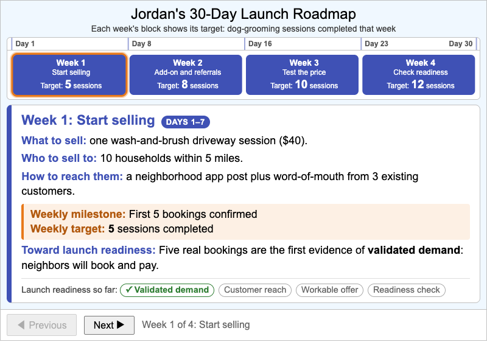

    A step-through timeline of Jordan's 30-day launch plan showing each week's plan, weekly milestone, and weekly target, and how the four weeks build toward launch readiness.

-   **[Assumption Ledger Sorter](./assumption-ledger-sorter/index.md)**

    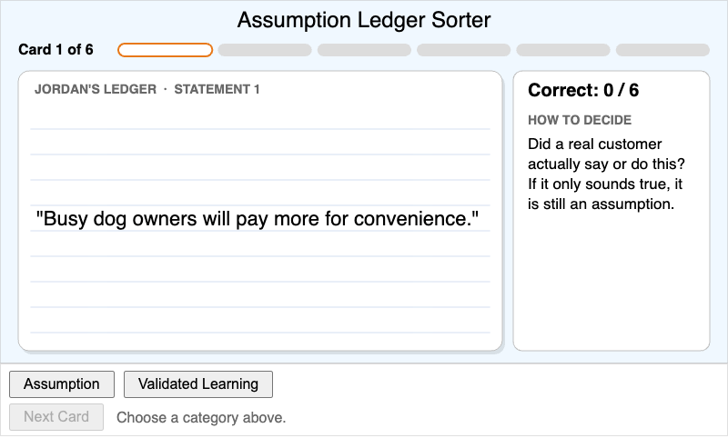

    A six-card sorting quiz in which learners classify statements from Jordan's dog-grooming idea as either untested assumptions or validated learning, with immediate feedback on every card.

-   **[Benefit vs Advantage Sorter](./benefit-vs-advantage-sorter/index.md)**

    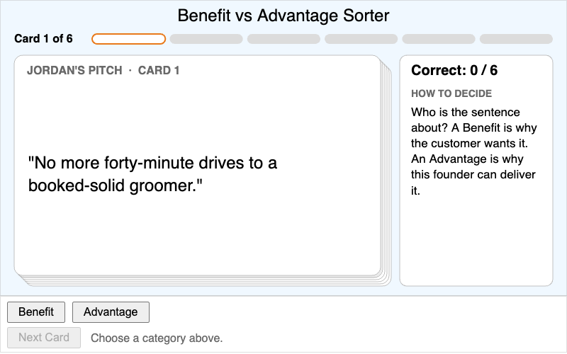

    A six-card sorting quiz in which learners classify value-proposition statements from Jordan's dog-grooming idea as customer Benefits or founder Advantages, with immediate feedback on every card.

-   **[Break-Even Calculator](./break-even-calculator/index.md)**

    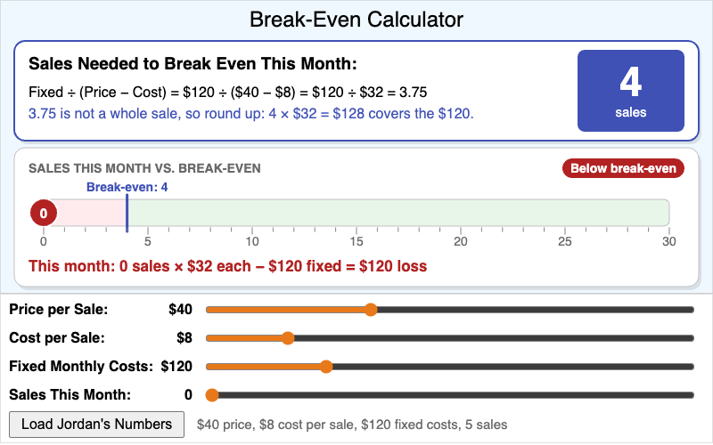

    Learners adjust price, cost per sale, and fixed monthly cost sliders to calculate how many sales a lean venture needs to break even, starting from Jordan's $40 dog-grooming session.

-   **[CO.STARTERS Canvas Explorer](./costarters-canvas-explorer/index.md)**

    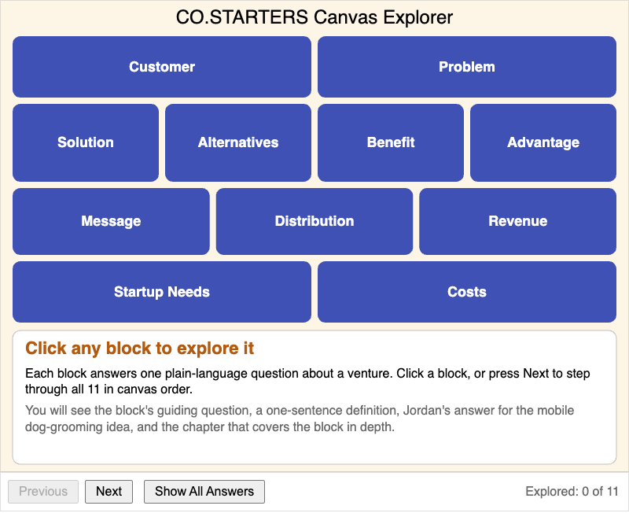

    A clickable map of the 11-block CO.STARTERS Canvas, filled in with Jordan's Session 1 dog-grooming answers, showing each block's guiding question, definition, example answer, and chapter.

-   **[Cohort Safety Signal Sorter](./cohort-safety-signal-sorter/index.md)**

    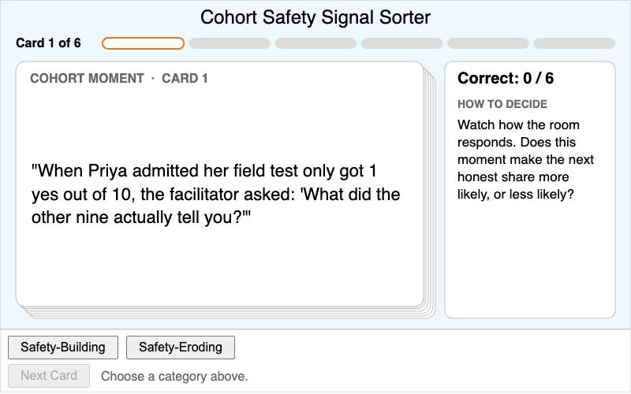

    A six-card sorting quiz in which learners classify moments from a live cohort session as Safety-Building or Safety-Eroding, with immediate feedback on every card.

-   **[Competitive Landscape Map](./competitive-landscape-map/index.md)**

    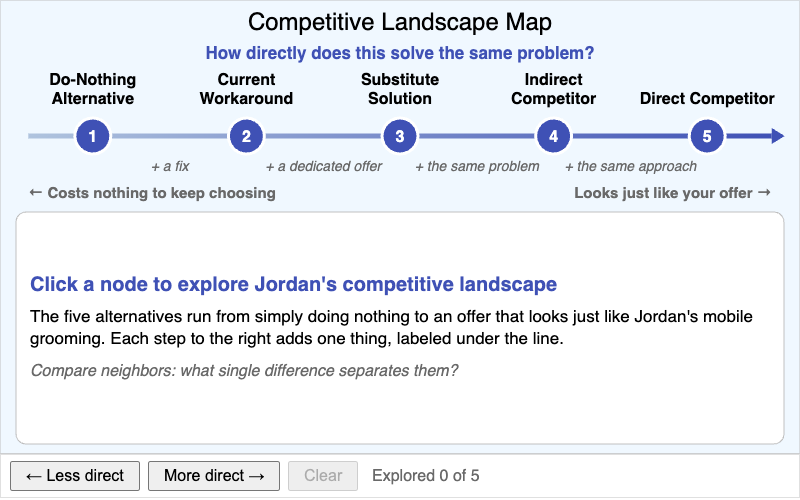

    Learners differentiate the five kinds of alternative to Jordan's mobile dog-grooming idea, from the do-nothing alternative to a direct competitor, by how directly each solves the same problem.

-   **[Customer Definition Funnel](./customer-definition-funnel/index.md)**

    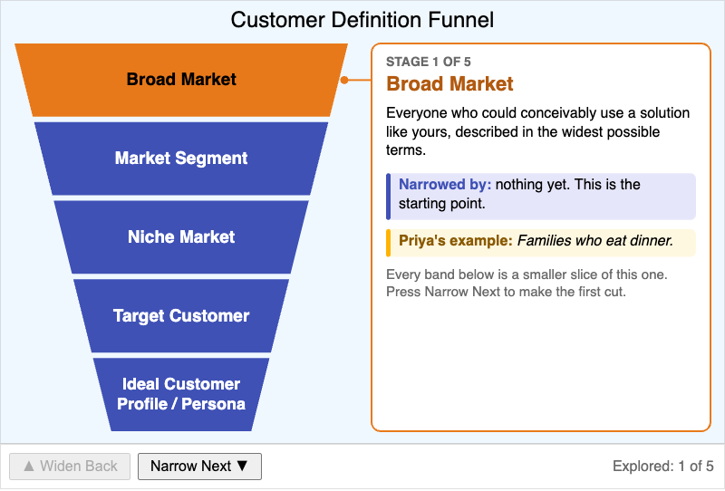

    A step-through funnel that narrows Priya's meal-prep market from families who eat dinner down to Dana, one persona, showing each stage's definition, the filter that narrowed it, and a concrete example.

-   **[Distribution Channel Map](./distribution-channel-map/index.md)**

    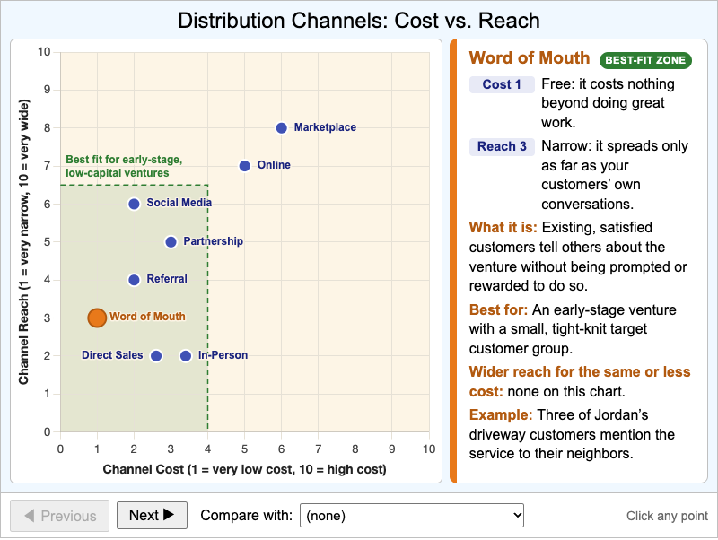

    An interactive scatter plot that places eight distribution channels by cost and reach, so learners can compare them and judge which ones fit an early-stage venture with limited resources.

-   **[Leading vs Open-Ended Question Sorter](./leading-vs-open-ended-sorter/index.md)**

    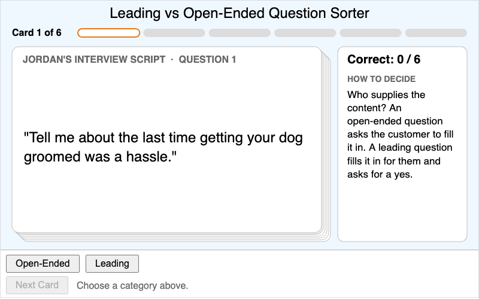

    A six-card sorting quiz in which learners classify discovery-interview questions as open-ended or leading, with immediate feedback and an open-ended rewrite of every leading question.

-   **[Minimum Testable Iteration Decision Tree](./minimum-testable-iteration-decision-tree/index.md)**

    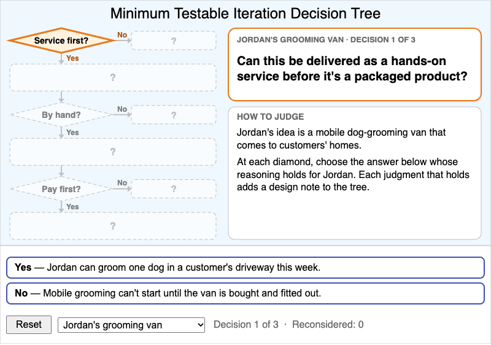

    Learners judge whether service before product, manual before automated, and pre-selling before building apply to Jordan's or Priya's venture, then justify the minimum testable iteration the three judgments produce.

-   **[Minimum Viable Offer Slider](./minimum-viable-offer-slider/index.md)**

    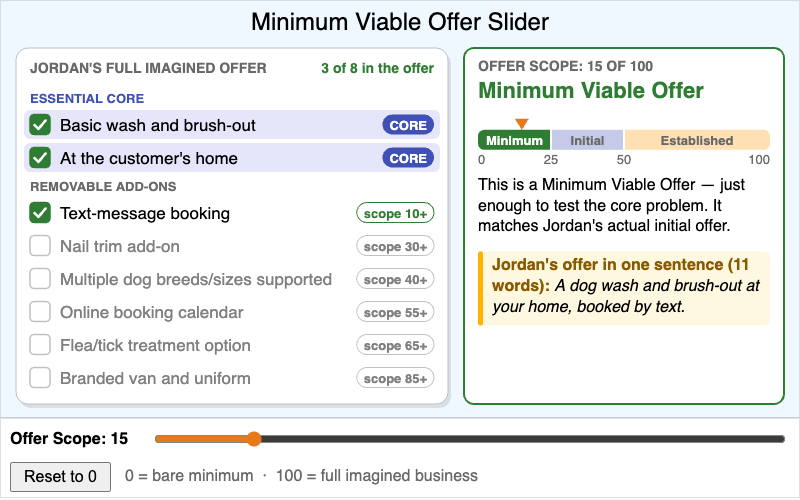

    Learners drag an Offer Scope slider to shrink or grow Jordan's mobile dog-grooming offer and see which features are the essential core and which are removable add-ons.

-   **[One-Sentence Value Proposition Builder](./one-sentence-value-proposition-builder/index.md)**

    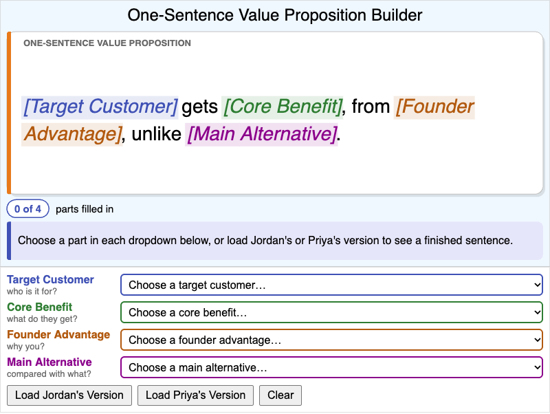

    Learners compose a one-sentence value proposition from four parts: target customer, core benefit, founder advantage, and main alternative. The sentence updates live, with feedback on missing parts, generic words, and read time.

-   **[Persevere vs Pivot Signal Checker](./persevere-vs-pivot-signal-checker/index.md)**

    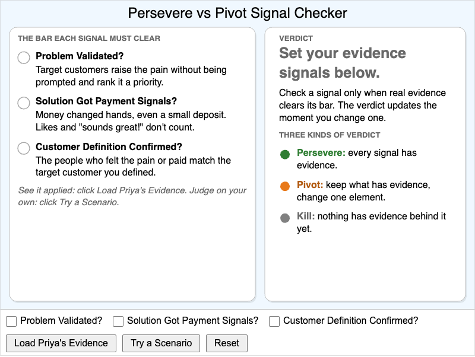

    Learners set three validation evidence signals to see whether the pattern supports a persevere, pivot, or kill decision, then judge the evidence from four practice ventures and get feedback on each signal.

-   **[Startup Needs Sorter](./startup-needs-sorter/index.md)**

    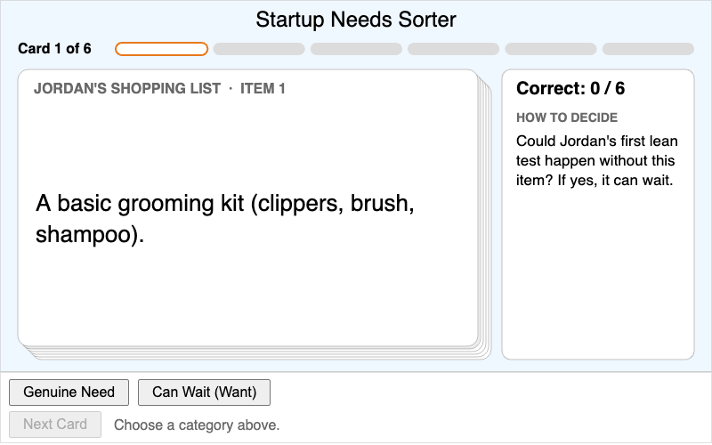

    A six-card sorting quiz in which learners classify items Jordan is considering buying as a Genuine Need or a want that can wait, with immediate feedback on every card.

-   **[Symptom vs Root Cause Drill-Down](./symptom-root-cause-drilldown/index.md)**

    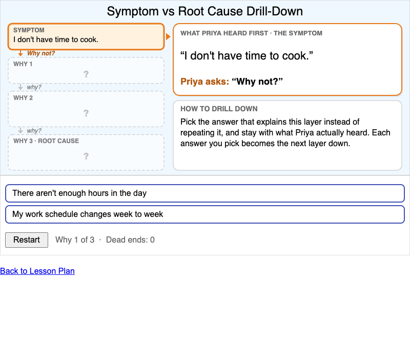

    Learners apply the repeated why technique to Priya's first interview complaint, choosing the answer that explains each layer until they reach the root cause, with feedback on every dead end.

-   **[The Field Discovery Window Rhythm](./field-discovery-window-rhythm/index.md)**

    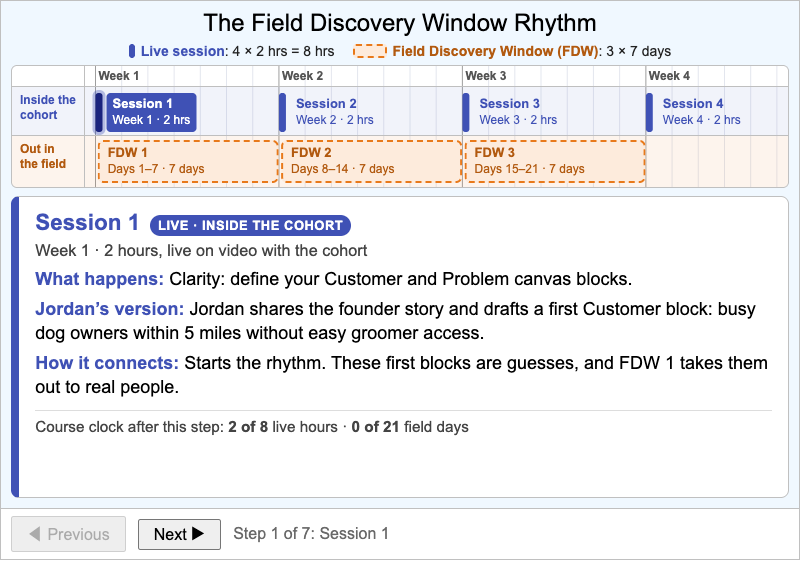

    A step-through timeline of the four-week course showing what happens in each 2-hour live session and each 7-day Field Discovery Window, and how each one feeds the next.

-   **[The Four-Phase Founder Pipeline](./four-phase-founder-pipeline/index.md)**

    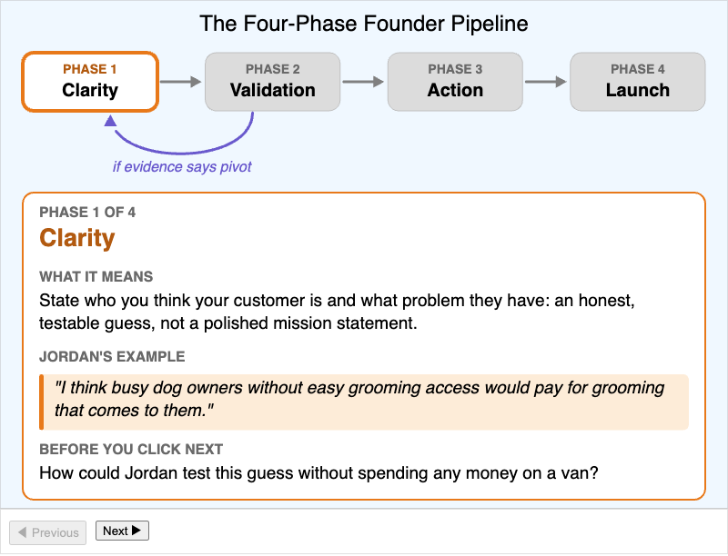

    A step-through infographic of the Clarity, Validation, Action, and Launch phases, pairing each definition with Jordan's concrete example and a predict-before-you-advance prompt.

-   **[The Idea Trap Cycle](./idea-trap-cycle/index.md)**

    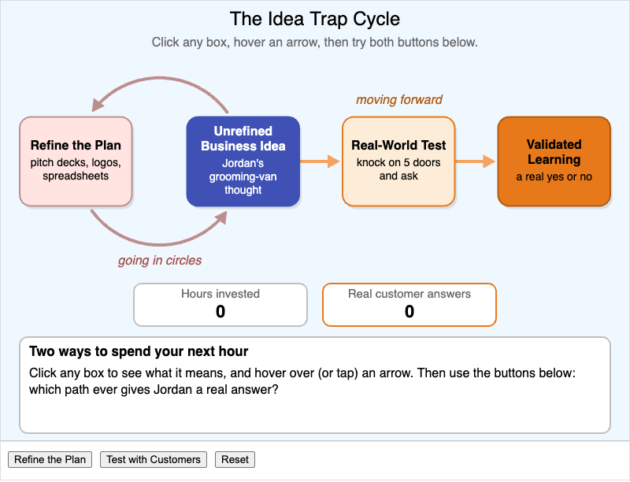

    An interactive diagram that contrasts the closed "refine the plan" loop with the open "real-world test" path, using counters to show that only testing produces real customer answers.

-   **[Two-Minute Pitch Structure and Timer](./two-minute-pitch-structure-timer/index.md)**

    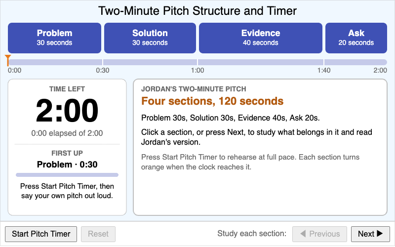

    Learners study the four timed sections of Jordan's two-minute pitch (Problem, Solution, Evidence, Ask), then rehearse their own pitch against a 120-second countdown that highlights each section on time.

